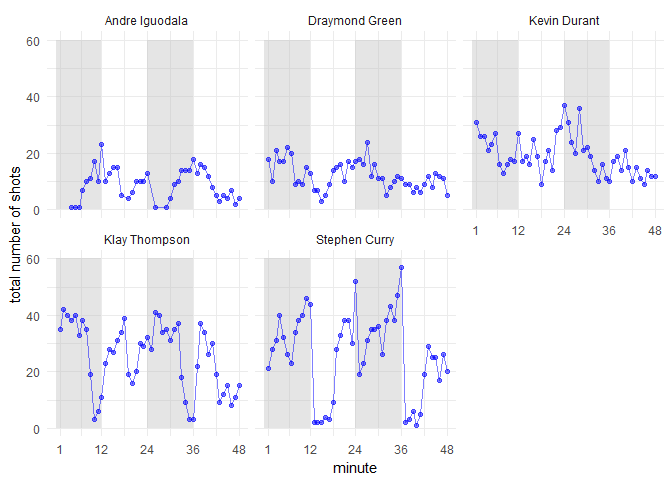

hw02 - Shot Charts
================
Hanmaro Song

``` r
library(dplyr)
```

    ## 
    ## Attaching package: 'dplyr'

    ## The following objects are masked from 'package:stats':
    ## 
    ##     filter, lag

    ## The following objects are masked from 'package:base':
    ## 
    ##     intersect, setdiff, setequal, union

``` r
library(ggplot2)
shots_data = read.csv('../data/shots-data.csv', stringsAsFactors = FALSE)
```

``` r
# Question 5.1
total_shots <- shots_data %>% 
  group_by(name) %>% 
  summarise(total = n(), na.rm=TRUE) %>% 
  select(name, total) %>% 
  arrange(desc(total))
total_shots
```

    ## # A tibble: 5 x 2
    ##   name           total
    ##   <chr>          <int>
    ## 1 Stephen Curry   1250
    ## 2 Klay Thompson   1220
    ## 3 Kevin Durant     915
    ## 4 Draymond Green   578
    ## 5 Andre Iguodala   371

``` r
# Question 5.2
effective <- shots_data %>% 
  group_by(name) %>% 
  filter(shot_made_flag == 'made shot') %>% 
  summarise(made = n(), na.rm=TRUE) %>% 
  select(name, made) %>% 
  inner_join(total_shots) %>% 
  select(name, total, made) %>%
  mutate(perc_made = made / total) %>% 
  arrange(desc(perc_made))
```

    ## Joining, by = "name"

``` r
effective
```

    ## # A tibble: 5 x 4
    ##   name           total  made perc_made
    ##   <chr>          <int> <int>     <dbl>
    ## 1 Kevin Durant     915   495     0.541
    ## 2 Andre Iguodala   371   192     0.518
    ## 3 Klay Thompson   1220   575     0.471
    ## 4 Stephen Curry   1250   584     0.467
    ## 5 Draymond Green   578   245     0.424

``` r
two_point <- shots_data %>% 
  filter(shot_type == '2PT Field Goal' & shot_made_flag == 'made shot') %>% 
  group_by(name) %>% 
  summarise(made = n(), na.rm=TRUE) %>% 
  select(name, made) %>%
  inner_join(total_shots,two_point, by = 'name') %>% 
  select(name, total, made) %>%
  mutate(perc_made=made/total) %>% 
  arrange(desc(perc_made))
two_point
```

    ## # A tibble: 5 x 4
    ##   name           total  made perc_made
    ##   <chr>          <int> <int>     <dbl>
    ## 1 Kevin Durant     915   390     0.426
    ## 2 Andre Iguodala   371   134     0.361
    ## 3 Draymond Green   578   171     0.296
    ## 4 Klay Thompson   1220   329     0.270
    ## 5 Stephen Curry   1250   304     0.243

``` r
three_point <- shots_data %>% 
  filter(shot_type == '3PT Field Goal' & shot_made_flag == 'made shot') %>% 
  group_by(name) %>% 
  summarise(made = n(), na.rm=TRUE) %>% 
  select(name, made) %>%
  inner_join(total_shots,three_point, by = 'name') %>% 
  select(name, total, made) %>%
  mutate(perc_made=made/total) %>% 
  arrange(desc(perc_made))
three_point
```

    ## # A tibble: 5 x 4
    ##   name           total  made perc_made
    ##   <chr>          <int> <int>     <dbl>
    ## 1 Stephen Curry   1250   280     0.224
    ## 2 Klay Thompson   1220   246     0.202
    ## 3 Andre Iguodala   371    58     0.156
    ## 4 Draymond Green   578    74     0.128
    ## 5 Kevin Durant     915   105     0.115

``` r
# Question 6.1

made_shots <- shots_data %>% 
  group_by(shot_distance) %>% 
  summarise(total = n(), made = sum(shot_made_flag == 'made shot'), na.rm = TRUE) %>% 
  select(shot_distance,total,made) %>% 
  mutate(made_shot_prop = made / total) %>% 
  select(shot_distance,made_shot_prop)
made_shots
```

    ## # A tibble: 56 x 2
    ##    shot_distance made_shot_prop
    ##            <int>          <dbl>
    ##  1             0          0.841
    ##  2             1          0.668
    ##  3             2          0.534
    ##  4             3          0.373
    ##  5             4          0.411
    ##  6             5          0.286
    ##  7             6          0.396
    ##  8             7          0.395
    ##  9             8          0.463
    ## 10             9          0.321
    ## # ... with 46 more rows

``` r
# Question 6.2
ggplot(made_shots) +
  geom_point(aes(shot_distance, made_shot_prop))
```

 1. When the distance is at 0, it has the highest chance to score. Then distance at 1 and 2 follows. From about 3 or 4 to 33, it has around slightly less than 50%. After that there is almost no chance at all to score except at 56 in which case there was one attempt that resulted in made shot.

1.  By the given graph, yes. Although some distance range (such as from 3 to 33?) has similar probability.

2.  From the distance at around 33ft, the probability can be considered as null.

3.  At 0, 1, 2(or upto 3), around 12, 16, 17, 21, 30 have 50% or more.

``` r
rect1 = data.frame(xmin=0, xmax = 12, ymin = 0, ymax = 60)
rect2 = data.frame(xmin=24, xmax = 36, ymin = 0, ymax = 60)

dat = select(shots_data, name, period, minutes_remaining, shot_made_flag)
dat = mutate(dat, time = period*12-minutes_remaining) %>% select(name, time)
dat = group_by(dat, name) %>% count(time)
dat = select(dat, name, time, shots = n)

chart_player_shots_per_min = ggplot(data = dat, aes(x=time, y=shots)) +
  geom_rect(data = rect1, aes(xmin=xmin, xmax=xmax, ymin=ymin, ymax=ymax), fill='gray', alpha=0.4, inherit.aes = FALSE) +
  geom_rect(data = rect2, aes(xmin=xmin, xmax=xmax, ymin=ymin, ymax=ymax), fill='gray', alpha=0.4, inherit.aes = FALSE) +
  geom_path(aes(x = time, y = shots),colour='blue',alpha=0.5) +
  geom_point(aes(x = time, y = shots),colour='blue',alpha=0.5) +
  facet_wrap(~ name) +
  ylim(0, 60) +
  scale_x_continuous( name = "minute", breaks=c(1,12,24,36,48)) +
  theme_minimal() +
  ylab("total number of shots")
chart_player_shots_per_min
```


